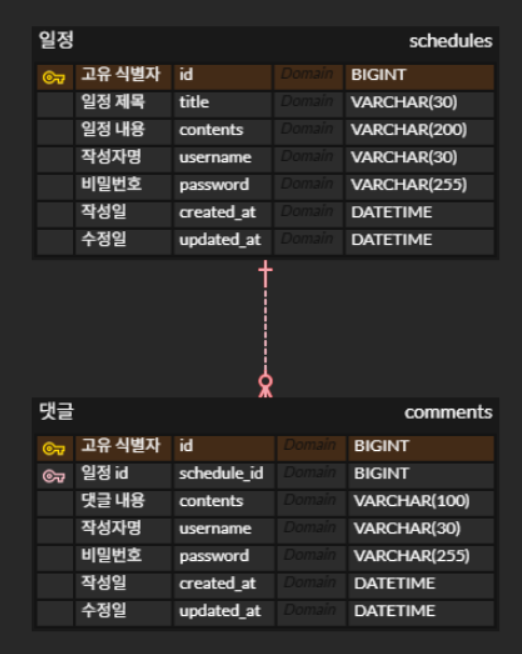

# Simple Scheduler API

- 내일배움캠프 Spring 8기 트랙 Chapter 3 일정 관리 앱 과제에 대한 리포지토리입니다.

## 1. 프로젝트 개요

- 간단한 일정과 댓글을 관리할 수 있는 API 서버입니다.
- Spring Boot와 Spring Web MVC 그리고 Spring Data JPA를 이용하여 개발했습니다.
- 개발 일정
    - 최초: 2025년 7월 29일 오전 10:00 → 2025년 8월 4일 오후 2:00
- 개발 인원: 1인

## 2. 주요 기능 및 주안점

### 2.1 주요 기능

- **일정 관리 (Lv.1 ~ Lv.4)**
    - 일정 생성 (제목, 내용, 작성자, 비밀번호)
    - 전체 및 특정 작성자별 일정 목록 조회 (수정일 기준 내림차순 정렬)
    - 특정 일정 조회
    - 일정 정보 수정 (비밀번호 일치 시)
    - 일정 삭제 (비밀번호 일치 시)
- **댓글 관리 (Lv.5 ~ Lv.6)**
    - 선택한 일정에 댓글 등록 (최대 10개)
    - 특정 일정 조회 시, 해당 일정의 댓글 목록 함께 반환
- **유효성 검증 (Lv.7)**
    - 요청 데이터의 제약 조건(길이, 필수값 등) 검증
    - 비밀번호 불일치 등 예외 상황에 대한 처리

### 2.2 주안점

- OOP의 개념을 이해하고, OOP로 이루어진 Spring 프레임워크를 이해하면서 개발하기 위해 노력했습니다.
- 3 Layer Architecture(Controller, Service, Repository) 를 이해하고 적용하기 위해 노력했습니다.
- HTTP를 이해하고 올바른 RESTful API 및 클라이언트 개발자와의 협업을 고려하면서 API를 설계했습니다.
- 모던 Java의 문법을 의식적으로 사용하기 위해 노력했습니다.

## 3. 개발 환경

- **언어**: Java 17
- **프레임워크**: Spring Boot 3.2.x
- **데이터베이스**: MySQL 8.x
- **ORM**: Spring Data JPA
- **빌드 도구**: Gradle
- **기타**: Lombok, Postman

## 4. 프로젝트 구조 및 실행 방법

### 4.1 프로젝트 구조

```
Level1~7.io.github.seonrizee.scheduler
      ├── controller  # 1. 클라이언트의 요청을 받고 응답을 반환하는 계층
      ├── dto         # 2. 계층 간 데이터 전송을 위한 객체 (Request/Response)
      │    ├── request
      │    └── response
      ├── entity      # 3. 데이터베이스 테이블과 매핑되는 JPA 엔티티
      ├── exception   # 4. 전역 예외 처리를 위한 핸들러 및 커스텀 예외 클래스
      ├── mapper      # 5. Entity와 DTO 간의 변환 로직 담당
      ├── repository  # 6. DB에 접근하는 데이터 액세스 계층
      ├── service     # 7. 핵심 비즈니스 로직을 처리하는 계층
      └── validator   # 8. 요청 데이터의 유효성을 검증하는 로직 담당
            └── field

```

- Level 1~7까지 단계별로 모듈로 존재하며, 각 모듈마다 단계별로 과제 내용을 구현했습니다.

### 4.2 실행 방법

1. build.gradle 을 이용하여 의존성 동기화
2. .env.example 파일을 열어서 양식에 맞게 환경변수 내용 작성
3. 원하는 방식으로 환경변수 주입
    - 개발 환경에서는 간단히 Intellij 실행 환경 구성-옵션 수정-환경 변수 파일 등록 방법을 사용
4. 최종 버전인 **Level7** 모듈의 `Level7Application.java` 파일의 `main` 메소드를 실행
5. 애플리케이션이 `localhost:8080`에서 실행되면 Postman 등의 API 테스트 도구를 사용하여 테스트

## 5. 주요 설계 및 트러블 슈팅

### 5.1 ERD (Entity Relationship Diagram)



- 과제 조건 중 연관관계를 사용하지 말고 구현을 고민해보라는 가이드가 있어 외래키를 사용한 연관관계 설정을 하지 않고 논리 관계만 이용했습니다.

### 5.2 RESTful API 설계

**5.2.1. API 요약**

| **기능**   | **HTTP Method** | **URL**                    | **설명**            |
|----------|-----------------|----------------------------|-------------------|
| **[일정]** |                 |                            |                   |
| 일정 생성    | `POST`          | `/schedules`               | 새로운 일정을 등록합니다.    |
| 전체 일정 조회 | `GET`           | `/schedules`               | 모든 일정을 조회합니다.     |
| 선택 일정 조회 | `GET`           | `/schedules/{id}`          | 특정 ID의 일정을 조회합니다. |
| 일정 수정    | `PATCH`         | `/schedules/{id}`          | 특정 ID의 일정을 수정합니다. |
| 일정 삭제    | `DELETE`        | `/schedules/{id}`          | 특정 ID의 일정을 삭제합니다. |
| **[댓글]** |                 |                            |                   |
| 댓글 생성    | `POST`          | `/schedules/{id}/comments` | 특정 일정에 댓글을 작성합니다. |

---

**5.2.2 API 상세 명세**

### 일정 생성

- **Method**: `POST`
- **URL**: `/schedules`
- **Description**: 새로운 일정을 등록합니다.

#### Request Body

```json
{
  "title": "String",
  "contents": "String",
  "username": "String",
  "password": "String"
}
```

#### Response (201 Created)

```json
{
  "statusCode": 201,
  "message": "요청을 성공적으로 처리했습니다.",
  "data": {
    "id": 1,
    "title": "새로운 일정",
    "contents": "새로운 일정 내용",
    "username": "작성자",
    "createdAt": "2025-08-01T10:00:00",
    "updatedAt": "2025-08-01T10:00:00",
    "comments": null
  }
}
```

-----

### 전체 일정 조회

- **Method**: `GET`
- **URL**: `/schedules`
- **Description**: 모든 일정을 조회합니다. `username`으로 필터링할 수 있습니다.

#### Query Parameters

- `username` (String, Optional): 조회할 작성자 이름

#### Response (200 OK)

```json
{
  "statusCode": 200,
  "message": "요청을 성공적으로 처리했습니다.",
  "data": [
    {
      "id": 2,
      "title": "두 번째 일정",
      "contents": "내용...",
      "username": "사용자B",
      "createdAt": "2025-08-01T11:00:00",
      "updatedAt": "2025-08-01T12:00:00",
      "comments": null
    },
    {
      "id": 1,
      "title": "첫 번째 일정",
      "contents": "내용...",
      "username": "사용자A",
      "createdAt": "2025-08-01T10:00:00",
      "updatedAt": "2025-08-01T10:00:00",
      "comments": null
    }
  ]
}
```

-----

### 선택 일정 조회

- **Method**: `GET`
- **URL**: `/schedules/{id}`
- **Description**: 특정 ID의 일정을 조회합니다. 댓글이 존재하는 경우 전체 댓글을 포함하여 응답합니다.

#### Path Parameters

- `id` (Number): 조회할 일정의 ID

#### Response (200 OK) - 댓글이 존재하지 않는 경우

```json
{
  "statusCode": 200,
  "message": "요청을 성공적으로 처리했습니다.",
  "data": {
    "id": 1,
    "title": "첫 번째 일정",
    "contents": "내용...",
    "username": "사용자A",
    "createdAt": "2025-08-01T10:00:00",
    "updatedAt": "2025-08-01T10:00:00",
    "comments": []
  }
}
```

#### Response (200 OK) - 댓글이 존재하는 경우

```json
{
  "statusCode": 200,
  "message": "요청을 성공적으로 처리했습니다.",
  "data": {
    "id": 1,
    "title": "첫 번째 일정",
    "contents": "내용...",
    "username": "사용자A",
    "createdAt": "2025-08-01T10:00:00",
    "updatedAt": "2025-08-01T10:00:00",
    "comments": [
      {
        "id": 101,
        "contents": "첫 번째 댓글입니다.",
        "username": "댓글러",
        "createdAt": "2025-08-01T10:05:00",
        "updatedAt": "2025-08-01T10:05:00"
      }
    ]
  }
}
```

-----

### 일정 수정

- **Method**: `PATCH`
- **URL**: `/schedules/{id}`
- **Description**: 특정 ID의 일정 정보를 수정합니다. (제목, 작성자명만 수정 가능)

#### Path Parameters

- `id` (Number): 수정할 일정의 ID

#### Request Body

```json
{
  "title": "String",
  "username": "String",
  "password": "String"
}
```

#### Response (200 OK)

```json
{
  "statusCode": 200,
  "message": "요청을 성공적으로 처리했습니다.",
  "data": {
    "id": 1,
    "title": "수정된 제목",
    "contents": "내용... (수정 안 됨)",
    "username": "수정된 작성자명",
    "createdAt": "2025-08-01T10:00:00",
    "updatedAt": "2025-08-01T13:00:00",
    "comments": null
  }
}
```

-----

### 일정 삭제

- **Method**: `DELETE`
- **URL**: `/schedules/{id}`
- **Description**: 특정 ID의 일정을 삭제합니다.

#### Path Parameters

- `id` (Number): 삭제할 일정의 ID

#### Request Body

```json
{
  "password": "String"
}
```

#### Response (204 No Content) -> (200 OK)

- 본래 성공 시, 응답 본문(Body) 없음이었으나, 클라이언트에서 일관성 있는 처리를 할 수 있도록 200 OK로 수정

```json
{
  "statusCode": 200,
  "message": "요청을 성공적으로 처리했습니다.",
  "data": null
}
```

-----

### 댓글 생성

- **Method**: `POST`
- **URL**: `/schedules/{id}/comments`
- **Description**: 특정 일정에 새로운 댓글을 작성합니다.

#### Path Parameters

- `id` (Number): 댓글을 작성할 일정의 ID

#### Request Body

```json
{
  "contents": "String",
  "username": "String",
  "password": "String"
}
```

#### Response (201 Created)

```json
{
  "statusCode": 201,
  "message": "요청을 성공적으로 처리했습니다.",
  "data": {
    "id": 102,
    "contents": "새로운 댓글 내용",
    "username": "새로운 댓글 작성자",
    "createdAt": "2025-08-01T14:00:00",
    "updatedAt": "2025-08-01T14:00:00"
  }
}
```

### 5.3 설계 및 트러블 슈팅 회고

[전체 회고 페이지 보러가기](https://seonrizee.github.io/blog/2025-08-04-ch3-schedule-api/)

1. **Q: DTO에 어떤 Lombok 어노테이션을 써야 하나요?**

   **A:** `setter`가 필요 없는 불변(Immutable) 객체를 위해 `@Getter`와 `@AllArgsConstructor`를 사용했습니다.

2. **Q: `save()` 후 DB가 생성한 ID는 어떻게 알 수 있나요?**

   **A:** `save()` 메서드는 ID가 부여된 완전한 엔티티를 반환하므로, 별도의 조회 없이 그 반환 값을 바로 사용하면 됩니다.

3. **Q: `findById()` 조회 결과가 없으면 어떻게 처리하나요?**

   **A:** 서비스에서 `orElseThrow()`로 예외를 발생시키고, `@RestControllerAdvice`에서 이 예외를 중앙에서 처리하여 `404 Not Found`를 반환합니다.

4. **Q: 필드가 비슷한 Request DTO, 재사용해도 되나요?**

   **A:** 아니요, `Create`, `Update` 등 각 요청의 목적에 맞게 DTO를 별도로 만드는 것이 명확성과 유효성 검증에 유리합니다.

5. **Q: 더티 체킹 시, 수정된 시간을 바로 DTO에 담아 반환하려면?**

   **A:** `repository.saveAndFlush()`를 호출하여 DB와 강제 동기화하면, JPA Auditing이 먼저 동작하여 최신 수정 시간을 DTO에 담아 반환할 수 있습니다.

6. **Q: `DELETE` 성공 후 서비스는 컨트롤러에 무엇을 반환하나요?**

   **A:** 성공은 '정상 종료'로, 실패는 '예외 발생'으로 알립니다. 따라서 서비스 메서드의 반환 타입은 `void`로도 충분합니다.

7. **Q: 서비스에서 다른 서비스의 기능이 필요할 때 어떻게 의존해야 하나요?**

   **A:** 레포지토리보다는 다른 서비스의 인터페이스에 의존하는 것이 의존성과 응집도를 낮출 수 있습니다.

8. **Q: 서비스 간 순환 참조는 어떻게 해결하나요?**

   **A:** 단순 조회만 필요하다면 해당 도메인의 Repository를 직접 주입받는 것도 실용적인 해결책입니다. 두 서비스가 공통으로 의존하는 로직을 별도의 유틸성 클래스로 분리할 수도 있습니다.

9. **Q: 엔티티와 DTO 변환 로직은 어디에 두어야 하나요?**

   **A:** 서비스 계층에서 처리하는 것이 기본이며, 변환 로직이 복잡해질 경우 별도의 `Mapper` 클래스를 만들어 사용할 수 있습니다. 엔티티가 DTO에 의존하는 것은 유의해야 합니다.

10. **Q: 반복되는 API 응답 생성 코드를 어떻게 개선하나요?**

    **A:** `ApiResponse` 같은 공통 DTO에 `ok(data)`, `created(data)`와 같은 정적 팩토리 메서드를 만들어 사용하면, 컨트롤러에서 일관되고 간결하게 응답을 생성할 수
    있습니다.

## 6. 브랜치 전략 및 커밋 컨벤션

### **6.1 브랜치 전략**

- develop 브랜치 개발 → main 브랜치 PR 적용
- 별도의 git flow나 github flow같은 브랜치 전략은 1인 프로젝트 과제 편의상 사용하지 않음

### **6.2 커밋 컨벤션**

```
feat: 새로운 기능 추가
fix: 버그 수정
refactor: 코드 리펙토링
test: 테스트 코드 추가 및 수정
docs: 문서 추가 및 수정
chore: code와 관련 없는 설정, 변경
```

- `타입(레벨): 제목` 형식으로 작성
- 일부 메시지는 상세 설명 작성
- [**Conventional Commits 참고**](https://www.conventionalcommits.org/ko/v1.0.0/)

## 7. 향후 개선 과제

1. **테스트 코드 작성**

   리팩토링을 본격적으로 하기 전에 기능을 하나씩 추가하는 단계에서는 단위 테스트를 나름대로 작성했습니다. 다만 리팩토링 이후에는 테스트 코드를 수정하는 것도 조금 부담으로 다가왔습니다.

   따라서, 테스트 코드 작성에 대한 방법론들을 많이 익혀보고, 단위 테스트를 용도에 맞게 작성하면서 API 통합 테스트까지 할 수 있도록 개선해야 할 것입니다.

2. **Swagger 도입**

   현재는 수동으로 관리하고 있는 API 명세서를 코드를 통해 자동으로 생성하고, 테스트 가능한 UI를 제공하여 API 문서 관리의 효율성을 높이기 위해 도입하려고 합니다.

3. **고아 객체 제거**

   현재 일정 삭제는 일정만 삭제되고 있으므로, 일정 삭제 시 관련된 댓글까지 삭제되도록 확장 방법에 대해 고민하고 개발해보려고 합니다.

4. **일정 전체 조회 시 댓글 함께 조회**

   현재는 일정 전체 조회에서는 댓글을 가져오지 않으므로, 댓글도 함께 가져오도록 기능을 구현하며 유명한 JPA N+1 문제에 대해 고민해보면 좋을 것 같습니다.

5. **ErrorCode Enum 확장**

   현재는 예외가 많지 않아서 별도로 구현하지는 않았지만, 애플리케이션의 모든 비즈니스 예외 상황을 상태 코드와 메시지와 함께 관리하는**`ErrorCode`같은 클래스의 Enum**으로 개선하면 좋을 것 이라고
   생각합니다.

   사실 이전에 실무에서 이렇게 개발했었는데, 예외 처리를 중앙에서 편리하게 관리할 수 있을뿐만 아니라, 클라이언트에서도 에러에 대해 분기적인 처리가 필요한 경우 쉽게 처리를 할 수 있습니다.