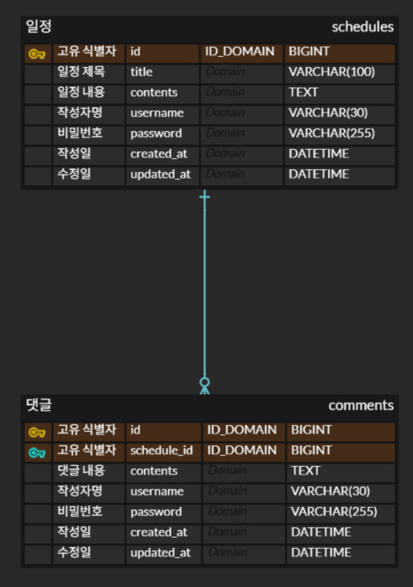

# Simple Scheduler API

# 1. ERD



# 2. API 명세

## 2-1. API 요약

| 기능       | HTTP Method | URL                        | 설명                |
|:---------|:------------|:---------------------------|:------------------|
| **[일정]** |             |                            |                   |
| 일정 생성    | `POST`      | `/schedules`               | 새로운 일정을 등록합니다.    |
| 전체 일정 조회 | `GET`       | `/schedules`               | 모든 일정을 조회합니다.     |
| 선택 일정 조회 | `GET`       | `/schedules/{id}`          | 특정 ID의 일정을 조회합니다. |
| 일정 수정    | `PATCH`     | `/schedules/{id}`          | 특정 ID의 일정을 수정합니다. |
| 일정 삭제    | `DELETE`    | `/schedules/{id}`          | 특정 ID의 일정을 삭제합니다. |
| **[댓글]** |             |                            |                   |
| 댓글 생성    | `POST`      | `/schedules/{id}/comments` | 특정 일정에 댓글을 작성합니다. |

---

## 2-2. API 상세 명세

### 일정 생성

- **Method**: `POST`
- **URL**: `/schedules`
- **Description**: 새로운 일정을 등록합니다.

#### Request Body

```json
{
  "title": "String",
  "contents": "String",
  "username": "String",
  "password": "String"
}
```

#### Response (201 Created)

```json
{
  "statusCode": 201,
  "message": "일정이 성공적으로 생성되었습니다.",
  "data": {
    "id": 1,
    "title": "새로운 일정",
    "contents": "새로운 일정 내용",
    "username": "작성자",
    "createdAt": "2025-08-01T10:00:00",
    "updatedAt": "2025-08-01T10:00:00"
  }
}
```

-----

### 전체 일정 조회

- **Method**: `GET`
- **URL**: `/schedules`
- **Description**: 모든 일정을 조회합니다. `username`으로 필터링할 수 있습니다.

#### Query Parameters

- `username` (String, Optional): 조회할 작성자 이름

#### Response (200 OK)

```json
{
  "statusCode": 200,
  "message": "일정 목록 조회를 성공했습니다.",
  "data": [
    {
      "id": 2,
      "title": "두 번째 일정",
      "contents": "내용...",
      "username": "사용자B",
      "createdAt": "2025-08-01T11:00:00",
      "updatedAt": "2025-08-01T12:00:00"
    },
    {
      "id": 1,
      "title": "첫 번째 일정",
      "contents": "내용...",
      "username": "사용자A",
      "createdAt": "2025-08-01T10:00:00",
      "updatedAt": "2025-08-01T10:00:00"
    }
  ]
}
```

-----

### 선택 일정 조회

- **Method**: `GET`
- **URL**: `/schedules/{id}`
- **Description**: 특정 ID의 일정을 조회합니다. 처음에는 댓글 없이, 도전 과제(Lv.6) 진행 시 댓글을 포함하여 응답합니다.

#### Path Parameters

- `id` (Number): 조회할 일정의 ID

#### Response (200 OK) - 기본 버전 (Lv.2)

```json
{
  "statusCode": 200,
  "message": "일정 조회를 성공했습니다.",
  "data": {
    "id": 1,
    "title": "첫 번째 일정",
    "contents": "내용...",
    "username": "사용자A",
    "createdAt": "2025-08-01T10:00:00",
    "updatedAt": "2025-08-01T10:00:00"
  }
}
```

#### Response (200 OK) - 댓글 포함 버전 (Lv.6)

```json
{
  "statusCode": 200,
  "message": "일정 조회를 성공했습니다.",
  "data": {
    "id": 1,
    "title": "첫 번째 일정",
    "contents": "내용...",
    "username": "사용자A",
    "createdAt": "2025-08-01T10:00:00",
    "updatedAt": "2025-08-01T10:00:00",
    "comments": [
      {
        "id": 101,
        "contents": "첫 번째 댓글입니다.",
        "username": "댓글러",
        "createdAt": "2025-08-01T10:05:00",
        "updatedAt": "2025-08-01T10:05:00"
      }
    ]
  }
}
```

-----

### 일정 수정

- **Method**: `PATCH`
- **URL**: `/schedules/{id}`
- **Description**: 특정 ID의 일정 정보를 수정합니다. (제목, 작성자명만 수정 가능)

#### Path Parameters

- `id` (Number): 수정할 일정의 ID

#### Request Body

```json
{
  "title": "String",
  "username": "String",
  "password": "String"
}
```

#### Response (200 OK)

```json
{
  "statusCode": 200,
  "message": "일정이 성공적으로 수정되었습니다.",
  "data": {
    "id": 1,
    "title": "수정된 제목",
    "contents": "내용... (수정 안 됨)",
    "username": "수정된 작성자명",
    "createdAt": "2025-08-01T10:00:00",
    "updatedAt": "2025-08-01T13:00:00"
  }
}
```

-----

### 일정 삭제

- **Method**: `DELETE`
- **URL**: `/schedules/{id}`
- **Description**: 특정 ID의 일정을 삭제합니다.

#### Path Parameters

- `id` (Number): 삭제할 일정의 ID

#### Request Body

```json
{
  "password": "String"
}
```

#### Response (204 No Content)

- 성공 시, 응답 본문(Body) 없음.

-----

### 댓글 생성

- **Method**: `POST`
- **URL**: `/schedules/{id}/comments`
- **Description**: 특정 일정에 새로운 댓글을 작성합니다.

#### Path Parameters

- `id` (Number): 댓글을 작성할 일정의 ID

#### Request Body

```json
{
  "contents": "String",
  "username": "String",
  "password": "String"
}
```

#### Response (201 Created)

```json
{
  "statusCode": 201,
  "message": "댓글이 성공적으로 등록되었습니다.",
  "data": {
    "id": 102,
    "contents": "새로운 댓글 내용",
    "username": "새로운 댓글 작성자",
    "createdAt": "2025-08-01T14:00:00",
    "updatedAt": "2025-08-01T14:00:00"
  }
}
```